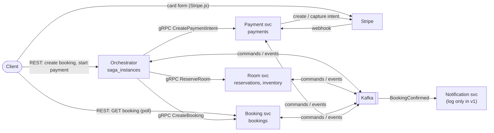
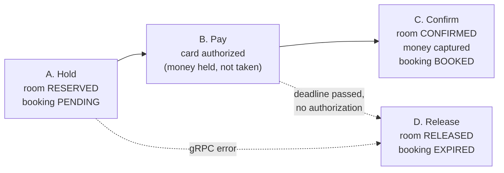

# UC1 — Create booking (hold room → pay → confirm → notify)

Design **v1 (lean)** · 2026-09-24. This version covers only the **major parts**: the smallest design that is correct, meaning no double booking, no charge without a room, and no room held forever.
Everything cut from v1 is in [good-to-have.md](good-to-have.md), with the reason it's safe to skip for now.

This folder is the detailed design. `doc/architecture_uc_create_order.excalidraw` stays the one-page picture; keep both in sync.

| File | What's inside |
|---|---|
| **README.md** (this) | context, phases, global rules, **build order** |
| [flows.md](flows.md) | one sequence diagram per phase + the shape of a message handler |
| [state-machines.md](state-machines.md) | saga steps + reservation / booking / payment states |
| [contracts.md](contracts.md) | REST, gRPC, Kafka topics, messages, envelope |
| [data-model.md](data-model.md) | schema changes per service + outbox |
| [good-to-have.md](good-to-have.md) | cut from v1 (G#) and parked edge cases (E#) |

**In scope:** user books one room for a date range, pays by card (Stripe, `capture_method=manual`), booking gets confirmed, notification is logged. If the user doesn't pay in time, the hold is released.
**Out of scope:** cancel (UC2), refund (UC3), modify, API Gateway + Cognito, SES, invoice, Redis.

---

## 1. System context

**Sync while the user is waiting, async after the pivot.** The pivot is `PaymentAuthorized`.

| From → To | How | Why |
|---|---|---|
| Client → Orchestrator | REST | user waits for "room held" / "here is your payment form" |
| Orchestrator → Room, Booking, Payment (before payment) | gRPC | same request; fail fast |
| Stripe → Payment | webhook | only the PSP knows the payment result |
| Orchestrator ↔ Room, Booking, Payment (after payment, and compensation) | Kafka command → reply event | nobody is waiting; must survive crashes |
| Booking → Notification | Kafka event `BookingConfirmed` | notification is a subscriber, never blocks the saga |

## 2. The four phases

| Phase | Trigger | Result | Saga steps |
|---|---|---|---|
| **A. Hold** | `POST /bookings` | room held until `deadline_at`, booking `PENDING` | `RESERVING_ROOM` → `CREATING_BOOKING` → `AWAITING_PAYMENT` |
| **B. Pay** | `POST /bookings/{id}/payment` + user pays on Stripe form | intent authorized → `PaymentAuthorized` | stays `AWAITING_PAYMENT` |
| **C. Confirm** | `PaymentAuthorized` | room `CONFIRMED` → payment `CAPTURED` → booking `BOOKED` → notification | `CONFIRMING_ROOM` → `CAPTURING_PAYMENT` → `CONFIRMING_BOOKING` → **COMPLETED** |
| **D. Release** | deadline worker, or a gRPC error in phase A | room `RELEASED` → booking `EXPIRED` (if it exists) | `RELEASING_ROOM` → `EXPIRING_BOOKING` → **FAILED** |

- There is only **one compensation path (D)**, used for both timeout and failure. It works by `sagaId`, so it's safe even when we don't know how far phase A got.
- A declined card does **not** end the saga. The user can retry on the Stripe form until the deadline.
- Why no "cancel payment" step in D: we never capture unless the room was confirmed, so an authorization that arrives after the deadline is just ignored and the bank releases it. Voiding it immediately is G1.

## 3. Who owns what (v1)

| Service | Source of truth | Runs |
|---|---|---|
| **Orchestrator** | `saga_instances` | REST · Kafka consumer · outbox poller · **deadline worker** |
| **Room** | `reservations` (occupancy), `inventory` (price, closed days) | gRPC · Kafka consumer · outbox poller |
| **Booking** | `bookings` + `nightly_rates` | REST GET · gRPC · Kafka consumer · outbox poller |
| **Payment** | `payments`, everything Stripe | gRPC · webhook · Kafka consumer · outbox poller |
| **Notification** | none in v1 | Kafka consumer (logs "email sent") |

The orchestrator stays a separate service, not merged into Booking. Seeing the saga as its own unit is the learning goal.

## 4. Global rules (the only mechanisms v1 needs)

1. **`saga_id` everywhere.** Every participant row (`reservations`, `bookings`, `payments`) has `saga_id UNIQUE`. Commands find their row **by `sagaId`**, and gRPC calls with an existing `saga_id` return the existing row.
2. **Outbox.** A state change and its outgoing message go into one DB transaction, and a poller publishes them to Kafka.
3. **Idempotency by state.** A handler first checks the current status:
   - already in the target → reply success again
   - in an allowed "from" status → update and reply
   - otherwise → ignore and log

   This makes duplicate and late messages harmless without inbox tables (G5). Rules per entity are in [state-machines.md](state-machines.md#guards).
4. **No DB transaction across a network call** (gRPC, Stripe). Save → call → save the result.
5. **Money never comes from the client.** Prices come from room inventory.
6. **Kafka key = `sagaId`.**
7. **The user comes from the request.** A `UserFromRequest` port reads `X-User-*` headers or a dev JWT in v1; Cognito comes in Phase 3.

## 5. Timers

| Name | Default | Meaning |
|---|---|---|
| `HOLD_TTL` | 15 min | at saga start, `deadline_at = now + HOLD_TTL`, also sent to Room as the reservation's `expires_at` |
| `DEADLINE_POLL` | 10 s | deadline worker interval |
| `GRPC_TIMEOUT` | 3 s | no retry in v1: an error goes to phase D (retries = G3) |

## 6. Build order (each milestone is testable on its own)

| # | Milestone | Done when |
|---|---|---|
| **M1** | `contracts/` module (`envelope/`, `room/v1/room.proto` + buf generation); Room `ReserveRoom` gRPC + exclusion constraint | `grpcurl` reserves; a second overlapping call fails with `ROOM_UNAVAILABLE` |
| **M2** | Booking `CreateBooking` gRPC (idempotent by `saga_id`) | `grpcurl` creates a `PENDING` booking; the same `saga_id` returns the same ID |
| **M3** | Orchestrator phase A: `POST /bookings` → ReserveRoom → CreateBooking (**no Kafka yet**) | Postman gets `201` with `bookingId`, `expiresAt`. On a gRPC error the saga moves to `RELEASING_ROOM` with an outbox row; it gets published once M4 exists |
| **M4** | Kafka (single-node docker, `infra/kafka`) + outbox poller + **phase D**: deadline worker → `ReleaseRoom` → `ExpireBooking` | a hold left unpaid is released and the booking is `EXPIRED` after `HOLD_TTL` (set it to 1 min for testing) |
| **M5** | Payment: `CreatePaymentIntent` + webhook → `PaymentAuthorized` (use `stripe listen` locally) | pay with test card `4242…`; `payments.status = AUTHORIZED` and the event is in Kafka |
| **M6** | Phase C chain + notification consumer | booking `BOOKED`, payment `CAPTURED` in the Stripe dashboard, notification log line |

M4 comes before M5 on purpose: the first Kafka flow (phase D) needs no Stripe, so you learn outbox and consumers on the simplest case.

## 7. Decisions (confirmed 2026-09-25)

| # | Question | Decision |
|---|---|---|
| Q1 | Booking statuses | `PENDING → BOOKED \| EXPIRED`; drop `RESERVED`, `RESERVATION_FAILED`, `PAYMENT_FAILED` ([state-machines.md](state-machines.md#booking)) |
| Q2 | Where `.proto` + shared message structs live | 2 modules in this repo: `contracts/` (proto + messages, one package per owning service) and `platform/` (outbox), wired with `replace` ([hexagonal-structure.md](../hexagonal-structure.md)) |
| Q3 | `HOLD_TTL` | 15 min |
