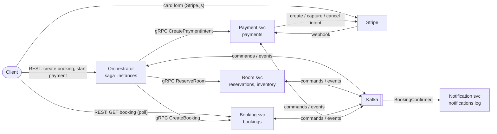
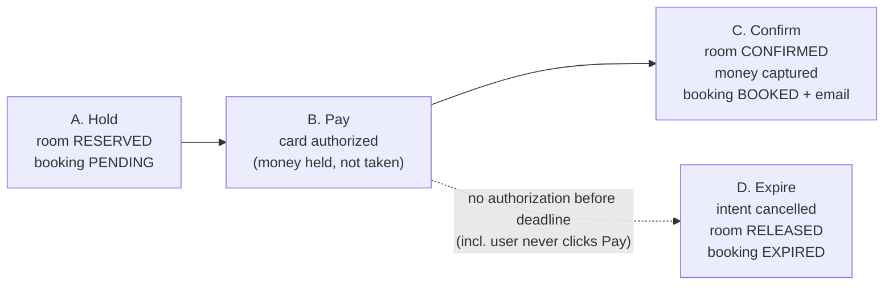

# UC1 — Create booking (hold room → pay → confirm → notify)

Design v1 · 2026-09-24 · covers the **main logic**. Tricky cases are parked in [edge-cases.md](edge-cases.md).

This folder is the detailed design. `doc/architecture_uc_create_order.excalidraw` stays the one-page picture; keep both in sync.
It replaces the step list in `use-cases.md` (UC1) and the "Suggested revised flow" in `plan.md`.

| File | What's inside | Open it when |
|---|---|---|
| **README.md** (this) | context, phases, who owns what, global rules, timers | first |
| [flows.md](flows.md) | one sequence diagram per phase + how a single saga step is processed | implementing a step |
| [state-machines.md](state-machines.md) | saga steps + reservation / booking / payment states, transition rules | writing orchestrator logic or status updates |
| [contracts.md](contracts.md) | REST, gRPC, Kafka topics, message catalog, envelope | writing handlers, consumers, proto |
| [data-model.md](data-model.md) | schema changes per service, outbox / inbox tables | writing migrations |
| [edge-cases.md](edge-cases.md) | parked cases + intended handling | later |

**In scope:** user books one room for a date range, pays by card (Stripe, `capture_method=manual`), booking gets confirmed, email is sent. If the user doesn't pay in time, the hold expires.
**Out of scope (later):** cancel (UC2), refund (UC3), modify booking, API Gateway + Cognito, invoice, Redis.

---

## 1. System context

**Rule of thumb: sync while the user is waiting, async after the pivot.**

| From → To | How | Why |
|---|---|---|
| Client → Orchestrator | REST, sync | user waits for "room held" / "here is your payment form" |
| Orchestrator → Room, Booking, Payment (before payment) | gRPC, sync | same request, user is waiting; fail fast |
| Stripe → Payment | webhook | only the PSP knows the payment result |
| Orchestrator ↔ Room, Booking, Payment (after payment) | Kafka command → reply event | nobody is waiting; each step must survive crashes and be retried |
| Booking → Notification | Kafka event `BookingConfirmed` | notification is a **subscriber**, not a saga step; an email failure must never block a booking |

The **pivot** is `PaymentAuthorized`: before it, anything can be undone cheaply. After it, the only way is forward (confirm → capture → book), except the rare case where the room confirm fails.

## 2. The four phases

| Phase | Trigger | Result | Saga steps |
|---|---|---|---|
| **A. Hold** | `POST /bookings` | room held for `HOLD_TTL`, booking `PENDING`, client gets `bookingId` + `expiresAt` | `RESERVING_ROOM` → `CREATING_BOOKING` → `AWAITING_PAYMENT` |
| **B. Pay** | `POST /bookings/{id}/payment`, then user pays on the Stripe form | Stripe PaymentIntent is **authorized** → Payment svc emits `PaymentAuthorized` | stays in `AWAITING_PAYMENT` |
| **C. Confirm** | `PaymentAuthorized` | room `CONFIRMED` → payment `CAPTURED` → booking `BOOKED` → email | `CONFIRMING_ROOM` → `CAPTURING_PAYMENT` → `CONFIRMING_BOOKING` → **COMPLETED** |
| **D. Expire** | deadline worker: still `AWAITING_PAYMENT` at `deadline_at` | intent cancelled (auth voided, user not charged) → room `RELEASED` → booking `EXPIRED` | `CANCELLING_PAYMENT` → `RELEASING_ROOM` → `EXPIRING_BOOKING` → **FAILED** |

A declined card does **not** end the saga. The Stripe PaymentIntent stays open, so the user can retry with another card until the deadline (see §6).

## 3. Who owns what

| Service | Source of truth for | Runs (processes / goroutines) |
|---|---|---|
| **Orchestrator** | `saga_instances`: progress of every booking attempt | REST API · Kafka consumer (`*.events`) · outbox publisher · **deadline worker** · **recovery worker** |
| **Room** | `reservations` (occupancy), `inventory` (price + closed days) | gRPC server · Kafka consumer (`room.commands`) · outbox publisher · hold sweeper (safety net) |
| **Booking** | `bookings` + `nightly_rates` (user and room snapshots) | REST (GET) · gRPC server · Kafka consumer (`booking.commands`) · outbox publisher |
| **Payment** | `payments`, everything Stripe | gRPC server · webhook endpoint · Kafka consumer (`payment.commands`) · outbox publisher |
| **Notification** | notification log (MongoDB) | Kafka consumer (`booking.events`) |

The orchestrator stays a **separate service** rather than being merged into Booking. For this project, seeing the saga as its own unit is the point, and it keeps Booking a plain participant. In industry it often lives inside the owning service (Booking) or runs on a workflow engine (Temporal, AWS Step Functions). Revisit in Phase 3.

## 4. Global rules (every service, every step)

1. **Idempotency by `sagaId`.** Every gRPC call and every command carries `sagaId`, and each service stores it with a UNIQUE constraint. A repeated call returns the **same result**, never a second row and never an error.
2. **Outbox.** A state change and its outgoing message are written in **one DB transaction**. A poller publishes to Kafka. CDC is not used.
3. **Inbox.** Every consumer stores the incoming `messageId` in the same transaction as its side effect. A duplicate is skipped (ack and do nothing).
4. **Guarded status updates.** `UPDATE … SET status = $new WHERE id = $1 AND status = ANY($allowedFrom)`. If 0 rows are updated, look at the current status: if it's already the target, reply success again; otherwise it's an invalid transition, so log it and reply failure. Rules per entity are in [state-machines.md](state-machines.md#guards).
5. **Never hold a DB transaction open across a network call** (gRPC, Stripe). Save state → call → save the result.
6. **Money never comes from the client.** Prices come from room inventory. The booking and the payment amount are derived from them.
7. **Kafka message key = `sagaId`**, so all messages of one saga land on one partition, in order.
8. **The user comes from the JWT.** The orchestrator puts the user snapshot (id, name, email, phone) into the saga context. It's stubbed in Phase 1 (see edge case E15).

## 5. Timers

| Name | Default | Meaning |
|---|---|---|
| `HOLD_TTL` | 15 min | `reservation.expires_at = now + HOLD_TTL`; saga `deadline_at = expires_at` |
| `HOLD_GRACE` | 15 min | room svc treats a hold as dead only after `expires_at + HOLD_GRACE` (sweeper + stale cleanup). The orchestrator normally releases on time; the grace covers the orchestrator being down |
| `DEADLINE_POLL` | 10 s | how often the deadline worker looks for expired `AWAITING_PAYMENT` sagas |
| `STUCK_AFTER` | 1 min | recovery worker: an in-flight saga not updated for this long gets its current step re-sent |
| `GRPC_TIMEOUT` | 3 s, 2 retries | retries reuse the same `sagaId`, so they're safe |

## 6. What this design changes vs. `plan.md`

- **Payment failure no longer ends the saga.** With Stripe, a declined card leaves the PaymentIntent in `requires_payment_method`, and the user can try another card. So UC1 has no `PaymentFailed` saga event: the saga ends by **authorization** or by **deadline**. Booking status `PAYMENT_FAILED` is no longer needed.
- **The deadline always wins cleanly.** With manual capture, Stripe can cancel an intent even when it's `requires_capture` (authorized): cancelling voids the hold and the user isn't charged. So the case "cancel fails because already authorized" from the plan doesn't happen. A `PaymentAuthorized` that arrives after the deadline is ignored (see E5).
- **Booking statuses (proposal, confirm):** `PENDING → BOOKED | EXPIRED`. Drop `RESERVED` (same meaning as `PENDING` when the room comes first), `RESERVATION_FAILED` (decided earlier) and `PAYMENT_FAILED` (see above). Add `EXPIRED`. Details in [state-machines.md](state-machines.md#booking).

## 7. Open questions (defaults already applied, confirm or change)

| # | Question | Default used in this design |
|---|---|---|
| Q1 | Booking statuses and `payment_status` values | see §6 and [state-machines.md](state-machines.md#booking) |
| Q2 | Where do `.proto` files and shared message structs live? | root `proto/` + one generated Go module `booking/contracts` (like the logger), wired with `replace` / `go.work` ([contracts.md](contracts.md#proto-location)) |
| Q3 | `HOLD_TTL` | 15 min |
| Q4 | Phase 1 auth (no Gateway/Cognito yet) | orchestrator reads an unsigned dev JWT or `X-User-*` headers behind a `UserFromRequest` port, swapped for real JWT verification in Phase 3 |
| Q5 | Client polling endpoint | client calls Booking svc `GET /bookings/{id}` directly (Gateway routes it later) |
