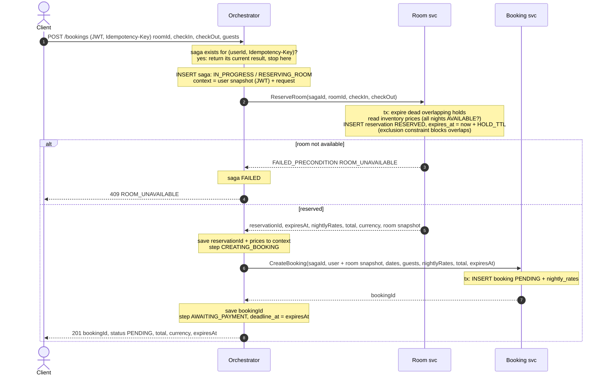
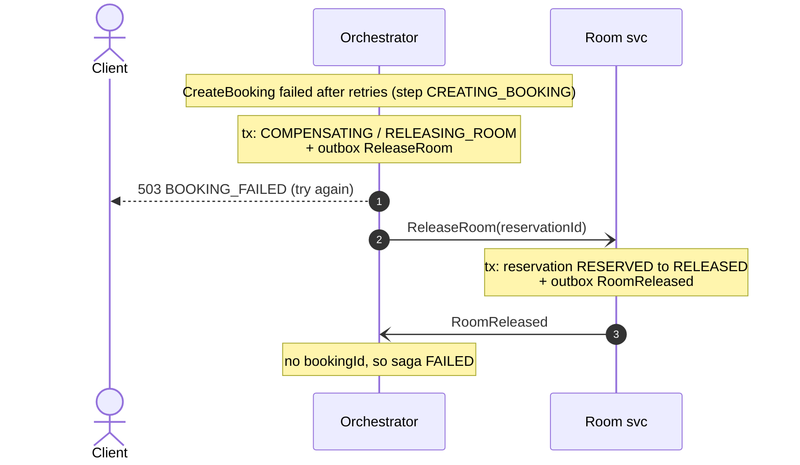
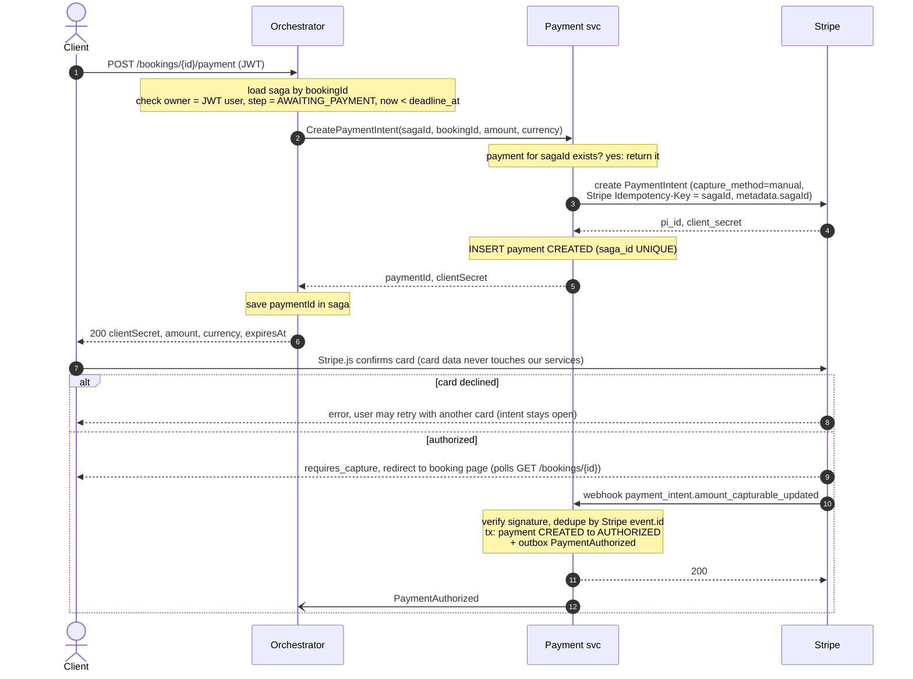
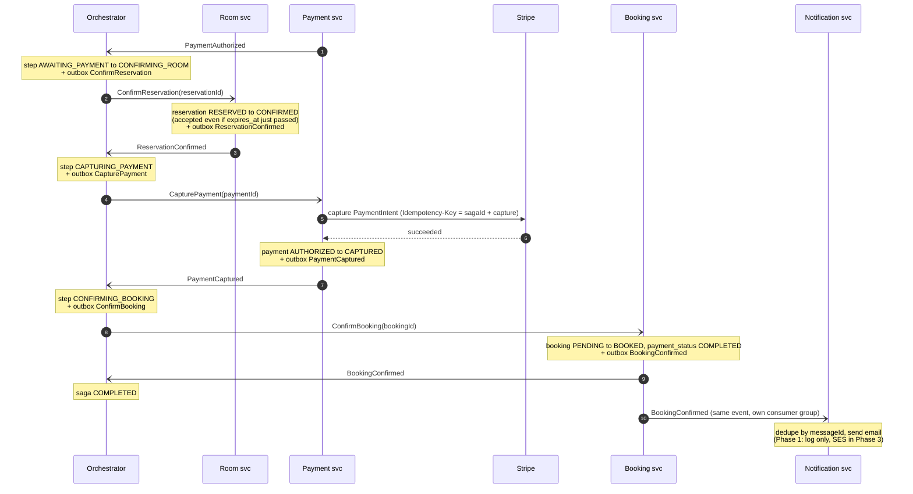
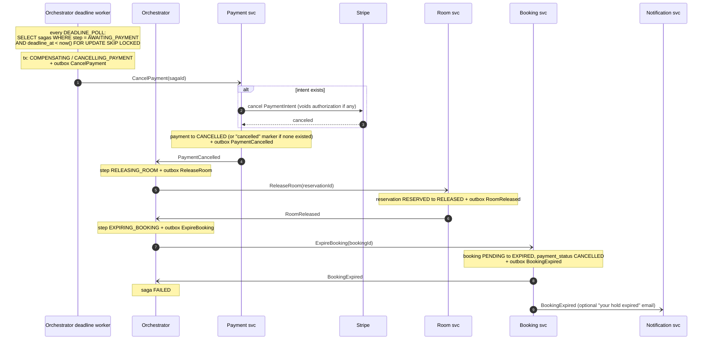
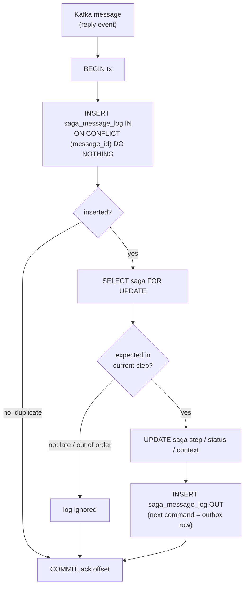
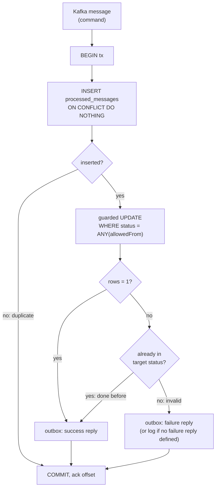

# UC1 flows

One diagram per phase. Legend:

- `->>` sync call (REST / gRPC / Stripe API), `-->>` its response
- `-)` async message via **Kafka**. It is always written to the sender's **outbox** in the same transaction as the state change, then published by the outbox poller. Kafka is not drawn as a box, to keep the diagrams readable.
- `Note` = what happens inside one DB transaction

Message fields are in [contracts.md](contracts.md), and the step and status names in [state-machines.md](state-machines.md).

---

## Phase A: hold room and create booking (sync)

Notes
- Steps 3 and 5 are each a short transaction. Rule 5 applies: no transaction stays open across the gRPC call. If the orchestrator crashes in between, the saga is left in `RESERVING_ROOM` or `CREATING_BOOKING` and the **recovery worker** re-sends the call. That's safe because of `sagaId` idempotency.
- A client retry with the same `Idempotency-Key` never creates a second hold (step 2).

### Phase A, compensation: CreateBooking fails

---

## Phase B: pay (sync start + user on Stripe + webhook)

Notes
- The Stripe call happens **before** the DB insert and is protected by Stripe's own `Idempotency-Key`. If the insert fails, a retry gets the same intent back from Stripe.
- The webhook handler only records the fact and returns 200 quickly. The saga logic runs in the orchestrator.
- The redirect and "success page" are UX only. The booking is confirmed only when Phase C finishes, which is why the client polls.

---

## Phase C: confirm → capture → book → notify (async)

Notes
- Why this order: **room first** (the only step that can legitimately fail), **then take the money**, **then** tell the booking. Nobody is charged for a room we couldn't confirm.
- If `ReservationConfirmFailed` comes back (the hold was already released), go to the Phase D path from `CANCELLING_PAYMENT`: the authorization is voided and the user isn't charged.
- `BookingConfirmed` is a **fat event**: it carries email, room number, dates and amount, so Notification never calls another service.

---

## Phase D: expire (deadline reached, no authorization)

Notes
- **Cancel the payment first, release the room second.** Released first, the room could be sold to someone else while this user's authorization is still alive.
- `CancelPayment` is keyed by `sagaId`, not `paymentId`. It also works when the user never clicked Pay, or when an intent is being created at this very moment (E4).
- A `PaymentAuthorized` arriving now is ignored by the orchestrator (step ≠ `AWAITING_PAYMENT`). The cancel already voided that authorization.

---

## Anatomy of one async step

Every Kafka consumer in this design follows the same shape. Learn it once and reuse it.

**Orchestrator consuming a reply event:**

**Participant (Room / Booking / Payment) consuming a command:**

Why "already in target → reply success again": the **recovery worker** re-sends a stuck step's command with a **new `messageId`**, so inbox dedupe doesn't catch it. The participant must answer from the current state, otherwise the saga waits forever.

Steps that call Stripe (`CapturePayment`, `CancelPayment`) call Stripe **before** opening the transaction, using a Stripe idempotency key. A crash after the Stripe call just repeats the same Stripe call on redelivery.
