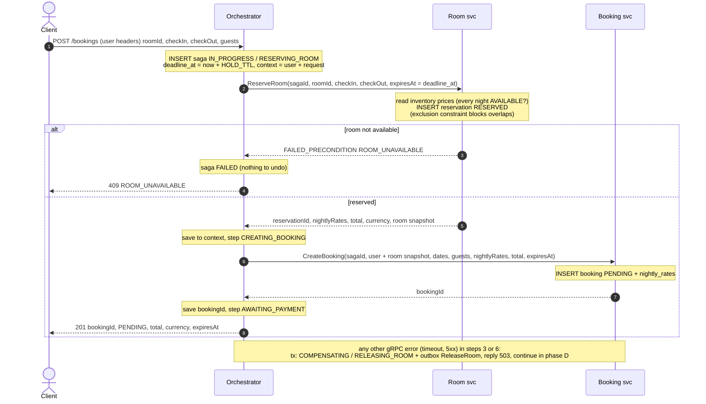
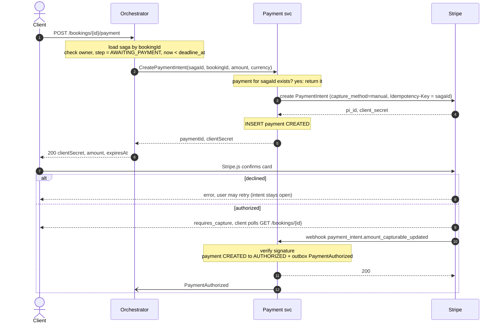
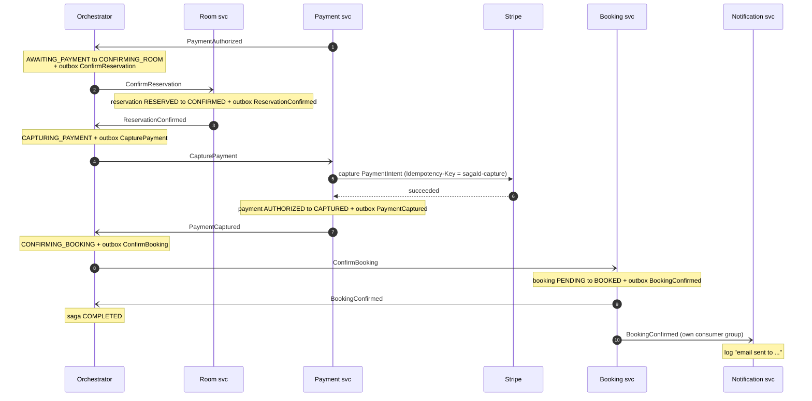
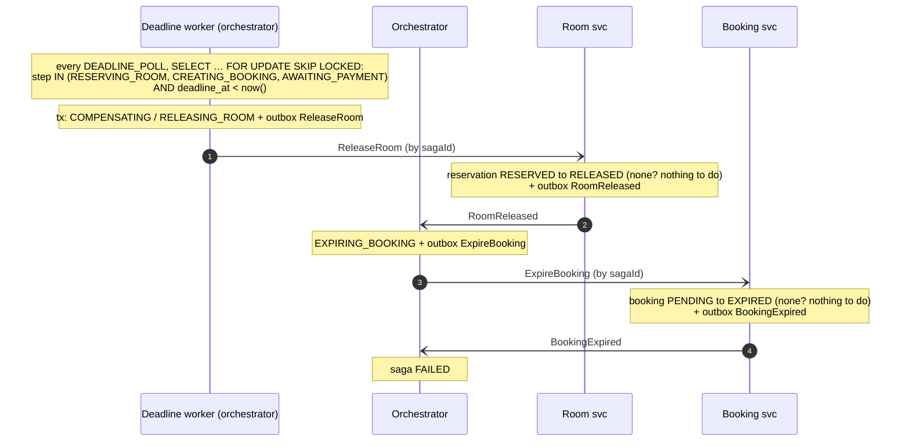
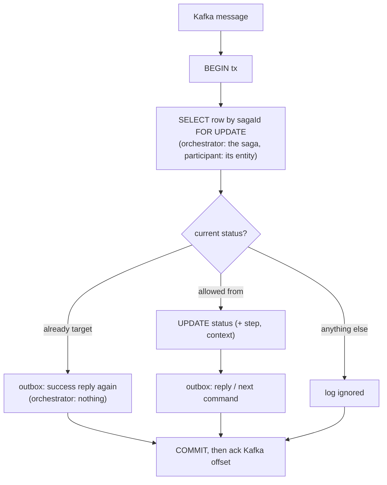

# UC1 flows (v1)

Legend:
- `->>` sync call (REST / gRPC / Stripe API), `-->>` its response
- `-)` async message via **Kafka**, always written to the sender's **outbox** in the same transaction as the state change (Kafka isn't drawn)
- `Note` = what happens inside one DB transaction

---

## Phase A: hold room and create booking (sync)

Each `Note` over O is its own short transaction, and no transaction stays open during a gRPC call. If the orchestrator crashes mid-phase, the saga keeps its `deadline_at`, so the **deadline worker** releases whatever was held (phase D).

---

## Phase B: pay

- Locally, `stripe listen --forward-to localhost:<port>/payments/api/v1/webhooks/stripe` delivers webhooks and prints the signing secret.
- A duplicate webhook finds the payment already `AUTHORIZED` → return 200 and do nothing (rule 3).

---

## Phase C: confirm → capture → book → notify

- Order: **room first** (make sure we have it), **then take the money**, **then** mark the booking.
- `ConfirmReservation` can't fail in v1: only the orchestrator releases holds, and it can't be releasing and confirming the same saga at once (row lock on the saga).
- If Stripe rejects the capture, Payment replies `PaymentCaptureFailed`, and the orchestrator marks the saga FAILED and logs it for a manual fix (automatic handling = G10).
- If `PaymentAuthorized` arrives after the deadline, the saga is no longer in `AWAITING_PAYMENT`, so it's ignored and never captured.

---

## Phase D: release (deadline or phase A error)

Both commands are looked up **by `sagaId`**, and "no row" is a valid success. That's why one path covers every case: timeout, a crash in phase A, or a gRPC timeout where we don't know whether the reservation or booking was created.

---

## Shape of every message handler

- **Ack after commit.** A crash between the two means the message comes again, and the status check turns the duplicate into a no-op.
- Handlers that call Stripe (`CapturePayment`) check the status first, call Stripe with an idempotency key **outside** the transaction, then run the transaction above.
