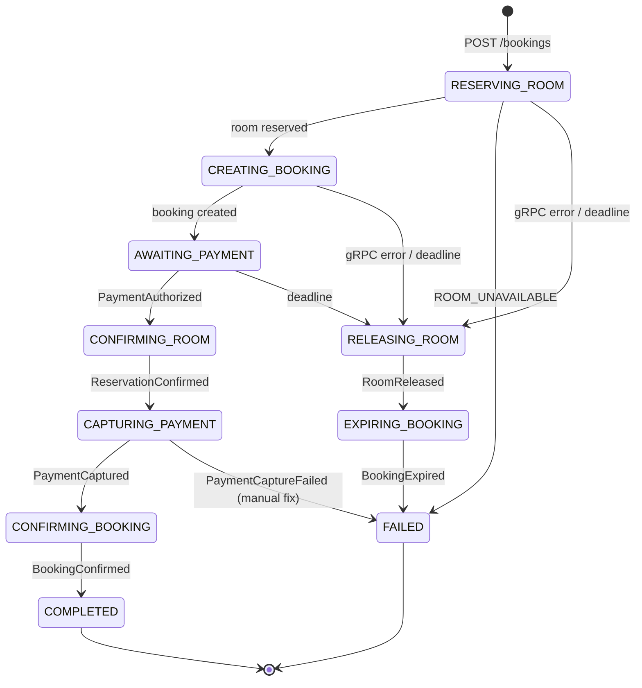
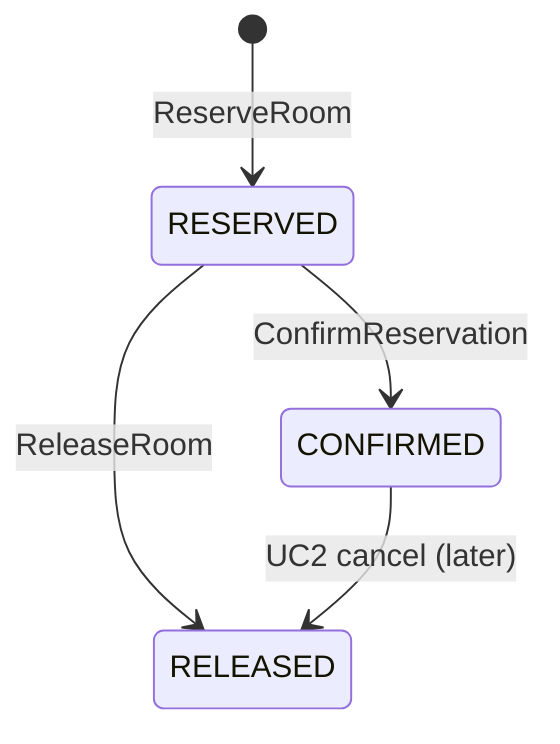
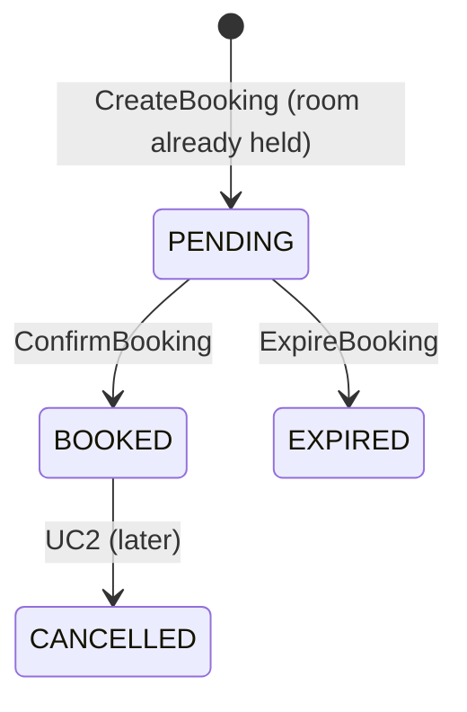
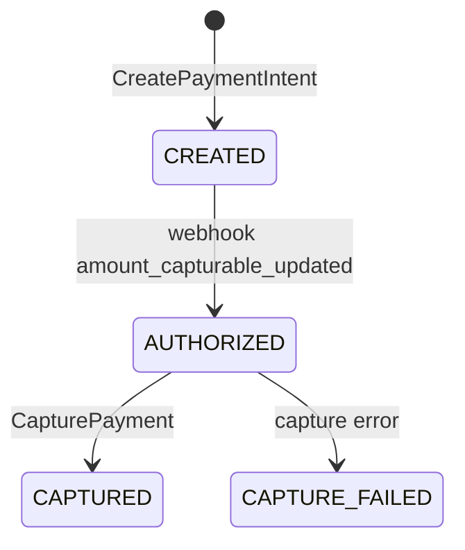

# UC1 state machines (v1)

Only the **saga** knows the whole flow. Each entity only knows its own legal transitions.

## Saga

Owned by the orchestrator (`saga_instances`).

| `status` | steps |
|---|---|
| `IN_PROGRESS` | `RESERVING_ROOM`, `CREATING_BOOKING`, `AWAITING_PAYMENT`, `CONFIRMING_ROOM`, `CAPTURING_PAYMENT`, `CONFIRMING_BOOKING` |
| `COMPENSATING` | `RELEASING_ROOM`, `EXPIRING_BOOKING` |
| `COMPLETED` / `FAILED` | terminal; `current_step` keeps the last step |

### Transition table

| Current step | Input | Action (one tx) | Next |
|---|---|---|---|
| — | `POST /bookings` | insert saga, `deadline_at` | `RESERVING_ROOM` → call ReserveRoom |
| `RESERVING_ROOM` | ok | save reservation + prices | `CREATING_BOOKING` → call CreateBooking |
| `RESERVING_ROOM` | `ROOM_UNAVAILABLE` | — | **FAILED** |
| `CREATING_BOOKING` | ok | save bookingId | `AWAITING_PAYMENT` |
| `RESERVING_ROOM`, `CREATING_BOOKING` | other gRPC error | outbox `ReleaseRoom` | `RELEASING_ROOM` |
| `RESERVING_ROOM`, `CREATING_BOOKING`, `AWAITING_PAYMENT` | deadline worker | outbox `ReleaseRoom` | `RELEASING_ROOM` |
| `AWAITING_PAYMENT` | `POST …/payment` | call CreatePaymentIntent, save paymentId | *(same)* |
| `AWAITING_PAYMENT` | `PaymentAuthorized` | outbox `ConfirmReservation` | `CONFIRMING_ROOM` |
| `CONFIRMING_ROOM` | `ReservationConfirmed` | outbox `CapturePayment` | `CAPTURING_PAYMENT` |
| `CAPTURING_PAYMENT` | `PaymentCaptured` | outbox `ConfirmBooking` | `CONFIRMING_BOOKING` |
| `CAPTURING_PAYMENT` | `PaymentCaptureFailed` | log error (G10) | **FAILED** |
| `CONFIRMING_BOOKING` | `BookingConfirmed` | — | **COMPLETED** |
| `RELEASING_ROOM` | `RoomReleased` | outbox `ExpireBooking` | `EXPIRING_BOOKING` |
| `EXPIRING_BOOKING` | `BookingExpired` | — | **FAILED** |
| *anything else* | any message | log "ignored", ack | *(unchanged)* |

The last row handles duplicates, late messages and races. For example, if the deadline worker and `PaymentAuthorized` race, both lock the saga row. The first one wins and the second finds a different step, so it's ignored.

---

## Reservation

Owned by room svc.

Occupying statuses are `RESERVED` and `CONFIRMED`; the exclusion constraint only looks at these. `expires_at` is stored for information, and only the orchestrator's deadline worker acts on it (a room-side sweeper is G6).

## Booking

Owned by booking svc.

**Proposed enum changes (confirm):**

| Enum | Proposed | Removed / added |
|---|---|---|
| `booking_status` | PENDING, BOOKED, **EXPIRED**, CANCELLED, CHECKED_IN, CHECKED_OUT, NO_SHOW | removed `RESERVED` (= `PENDING` when the room comes first), `RESERVATION_FAILED` (a failed hold creates no booking), `PAYMENT_FAILED` (a declined card doesn't end the saga, the deadline does) |
| `payment_status` (mirror on booking) | unchanged for v1 | set `COMPLETED` together with `BOOKED`; leave `PENDING` on `EXPIRED` (`CANCELLED` = G15) |

## Payment

Owned by payment svc.

| Stripe PaymentIntent status | `payments.status` |
|---|---|
| `requires_payment_method` / `requires_confirmation` / `requires_action` | `CREATED` (declined attempts stay here) |
| `requires_capture` | `AUTHORIZED` |
| `succeeded` | `CAPTURED` |

`CANCELLED` (voiding the authorization on expiry) is G1.

---

## Guards

One rule for every handler, see [flows.md](flows.md#shape-of-every-message-handler).

| Entity | Target | Allowed from | Already in target | Anything else |
|---|---|---|---|---|
| reservation | `CONFIRMED` | `RESERVED` | reply `ReservationConfirmed` | log |
| reservation | `RELEASED` | `RESERVED` | reply `RoomReleased` | no row → reply `RoomReleased` |
| booking | `BOOKED` | `PENDING` | reply `BookingConfirmed` | log |
| booking | `EXPIRED` | `PENDING` | reply `BookingExpired` | no row → reply `BookingExpired` |
| payment | `AUTHORIZED` | `CREATED` | 200 to Stripe, no event | log |
| payment | `CAPTURED` | `AUTHORIZED` | reply `PaymentCaptured` | reply `PaymentCaptureFailed` |
