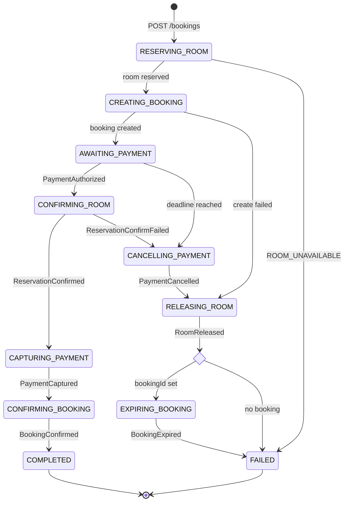
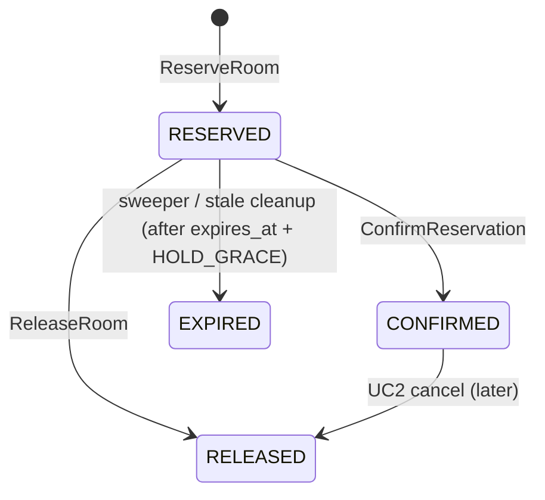
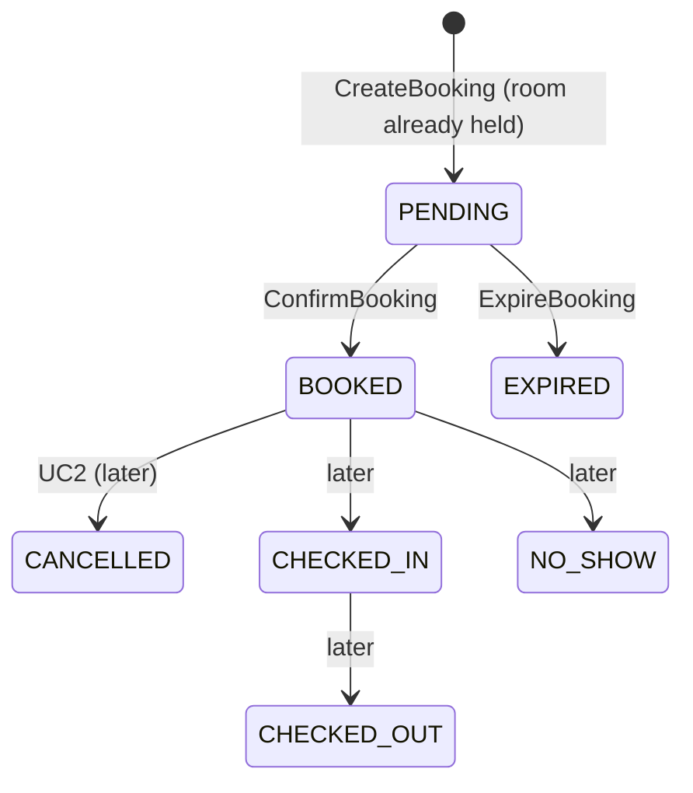
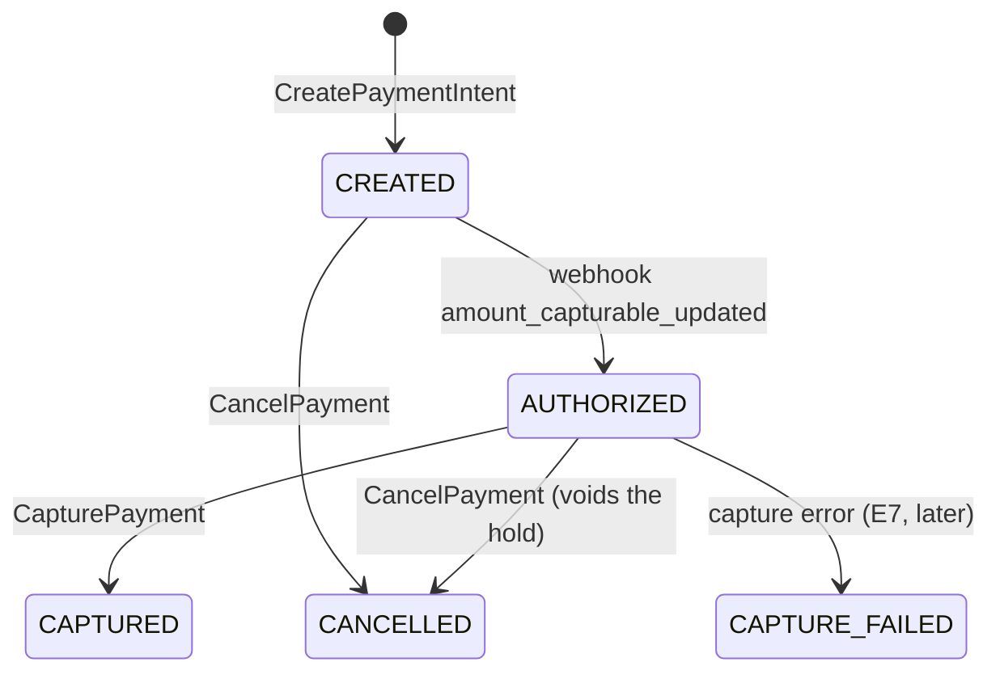

# UC1 state machines

There are four state machines. Only the **saga** knows the whole flow. Each entity only knows its own legal transitions.

## Saga

Owned by the orchestrator (`saga_instances`).

`current_step` holds the step name. `status` is derived from it:

| `status` | steps |
|---|---|
| `IN_PROGRESS` | `RESERVING_ROOM`, `CREATING_BOOKING`, `AWAITING_PAYMENT`, `CONFIRMING_ROOM`, `CAPTURING_PAYMENT`, `CONFIRMING_BOOKING` |
| `COMPENSATING` | `CANCELLING_PAYMENT`, `RELEASING_ROOM`, `EXPIRING_BOOKING` |
| `COMPLETED` / `FAILED` | terminal; `current_step` keeps the last step for debugging |

### Transition table (what the orchestrator does)

| Current step | Input | Action (one tx) | Next step |
|---|---|---|---|
| — | `POST /bookings` | insert saga | `RESERVING_ROOM` → call `ReserveRoom` |
| `RESERVING_ROOM` | gRPC ok | save reservation + prices | `CREATING_BOOKING` → call `CreateBooking` |
| `RESERVING_ROOM` | `ROOM_UNAVAILABLE` | — | **FAILED** |
| `CREATING_BOOKING` | gRPC ok | save bookingId, `deadline_at` | `AWAITING_PAYMENT` |
| `CREATING_BOOKING` | gRPC failed after retries | outbox `ReleaseRoom` | `RELEASING_ROOM` |
| `AWAITING_PAYMENT` | `POST /bookings/{id}/payment` | call `CreatePaymentIntent`, save paymentId | *(same step)* |
| `AWAITING_PAYMENT` | `PaymentAuthorized` | outbox `ConfirmReservation` | `CONFIRMING_ROOM` |
| `AWAITING_PAYMENT` | deadline worker | outbox `CancelPayment` | `CANCELLING_PAYMENT` |
| `CONFIRMING_ROOM` | `ReservationConfirmed` | outbox `CapturePayment` | `CAPTURING_PAYMENT` |
| `CONFIRMING_ROOM` | `ReservationConfirmFailed` | outbox `CancelPayment` | `CANCELLING_PAYMENT` |
| `CAPTURING_PAYMENT` | `PaymentCaptured` | outbox `ConfirmBooking` | `CONFIRMING_BOOKING` |
| `CAPTURING_PAYMENT` | `PaymentCaptureFailed` | **parked**, see E7 | — |
| `CONFIRMING_BOOKING` | `BookingConfirmed` | — | **COMPLETED** |
| `CANCELLING_PAYMENT` | `PaymentCancelled` | outbox `ReleaseRoom` | `RELEASING_ROOM` |
| `RELEASING_ROOM` | `RoomReleased` | bookingId set? outbox `ExpireBooking` | `EXPIRING_BOOKING`, else **FAILED** |
| `EXPIRING_BOOKING` | `BookingExpired` | — | **FAILED** |
| *any other combination* | any message | log "ignored" and ack | *(unchanged)* |

The last row is what makes late, duplicate and out-of-order messages harmless. For example, a `PaymentAuthorized` that arrives after the deadline fired is ignored, and the cancel already voided that authorization.

**Recovery worker:** a saga in a non-waiting, non-terminal step (anything except `AWAITING_PAYMENT`, `COMPLETED`, `FAILED`) with `updated_at < now() - STUCK_AFTER` gets its step's call or command **re-sent**, with a new `messageId` and the same `sagaId`.

---

## Reservation

Owned by room svc.

- **Occupying statuses:** `RESERVED`, `CONFIRMED`. The exclusion constraint only looks at these.
- `ConfirmReservation` accepts `RESERVED` **even if `expires_at` has passed**. The orchestrator already decided within its deadline, so message latency must not break the booking. Only `RELEASED` or `EXPIRED` means failure.

## Booking

Owned by booking svc.

**Proposed enum changes (confirm):**

| Enum | Today | Proposed | Why |
|---|---|---|---|
| `booking_status` | PENDING, RESERVED, RESERVATION_FAILED, PAYMENT_FAILED, BOOKED, CANCELLED, CHECKED_IN, CHECKED_OUT, NO_SHOW | PENDING, BOOKED, **EXPIRED**, CANCELLED, CHECKED_IN, CHECKED_OUT, NO_SHOW | room-first, so a booking is born with the room held (`RESERVED` = `PENDING`); a reservation failure never creates a booking; a declined card doesn't end the saga, the deadline does → `EXPIRED` |
| `payment_status` (on booking, a read-only mirror for the UI) | PENDING, COMPLETED, FAILED, REFUNDED, PARTIALLY_REFUNDED | PENDING, COMPLETED, **CANCELLED**, REFUNDED, PARTIALLY_REFUNDED | expiry means "no money collected", not "failed"; `REFUNDED*` stays for UC3 |

`booking.payment_status` changes only together with `status`: `BOOKED` + `COMPLETED`, or `EXPIRED` + `CANCELLED`. Payment svc stays the source of truth for the payment itself.

## Payment

Owned by payment svc.

| Stripe PaymentIntent status | Our `payments.status` |
|---|---|
| `requires_payment_method`, `requires_confirmation`, `requires_action` | `CREATED` (declined attempts stay here; optionally log each attempt) |
| `requires_capture` | `AUTHORIZED` |
| `succeeded` | `CAPTURED` |
| `canceled` | `CANCELLED` |

---

## Guards

Every status write uses `WHERE status = ANY($allowedFrom)`. If 0 rows are updated and the row is already in the target status, reply success again. Otherwise reply failure or log it.

| Entity | Target | Allowed from | Failure reply |
|---|---|---|---|
| reservation | `CONFIRMED` | `RESERVED` | `ReservationConfirmFailed` |
| reservation | `RELEASED` | `RESERVED` | — (`RELEASED`/`EXPIRED` already → reply `RoomReleased`) |
| reservation | `EXPIRED` | `RESERVED` | — (sweeper, no reply) |
| booking | `BOOKED` | `PENDING` | log + alert (shouldn't happen) |
| booking | `EXPIRED` | `PENDING` | log + alert |
| payment | `AUTHORIZED` | `CREATED` | ignore (late webhook after cancel) |
| payment | `CAPTURED` | `AUTHORIZED` | `PaymentCaptureFailed` |
| payment | `CANCELLED` | `CREATED`, `AUTHORIZED` | — (already `CANCELLED` → reply `PaymentCancelled`) |

`RELEASED` and `EXPIRED` count as "already released" for `ReleaseRoom`: both mean the room is free again, so the reply is still `RoomReleased`.
